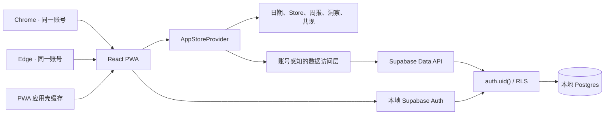
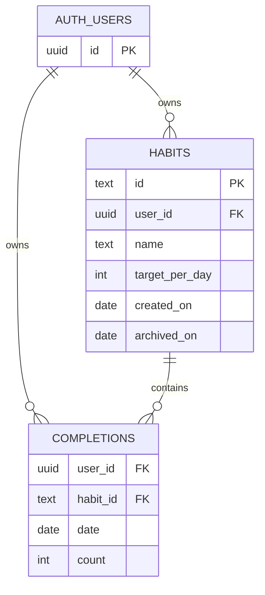

# ARCHITECTURE — 项目级系统架构（活文档）

- **维护者**：`flow-kit/prompts/A-architect.md`（首次 / 重构）+ `flow-kit/prompts/A-evolve.md`（增量同步 ADR）
- **首次创建**：2026-07-31
- **最近修订**：2026-07-31（A-architect 重构：引入本地 Supabase 后端）
- **当前 ADR 编号最大值**：ADR-007

> `CONTEXT.md` 回答“AI 实施时遵守什么”；本文件回答“系统怎么搭起来”；单次 change 的 `DESIGN.md` 回答“这次变更怎么做”。
> 本轮重构只调整架构文档，不修改业务代码或数据库。ADR 理由、代价与推翻成本已由用户于 2026-07-31 确认。

---

## 1. 系统概览

### 1.1 一句话定位

一个个人自用、由本机 Supabase 统一存储数据的习惯记录、周复盘与长期洞察 PWA。当前目标只验证同一台电脑上两个浏览器登录同一账号后读取同一份数据。— 来源：用户于 2026-07-31 确认 A-architect 建议

### 1.2 服务边界图



- 页面、AppStore、领域层和本地 Repository 是当前已实现边界，见 `@src/App.tsx:12-42`、`@src/app/AppStore.tsx:16-128`、`@src/data/repository.ts:11-72`。
- Auth、Data API、RLS 与 Postgres 是已确认的目标边界，必须由后续 `local-postgres-backend` change 通过需求、设计、migration 和测试落地；本图不代表源码已经接入。— 来源：用户于 2026-07-31 确认 A-architect 建议
- PWA 应用壳配置见 `@vite.config.ts:1-29`。
- 仓库已有未提交 Supabase JS client、CLI 与本地 `config.toml`，但尚无业务 migration，`src/` 也尚未引用。— 来源：`@package.json:16-35`、`@supabase/config.toml`、2026-07-31 A-architect 扫描

### 1.3 关键非功能性指标（NFR 基线）

| 维度 | 当前基线 | 来源 |
|---|---|---|
| 服务端 QPS / P95 | QPS 待测；本地读取目标 1 秒内，实际 P95 待测 | 用户于 2026-07-31 确认 A-architect 建议 |
| 并发用户 | 1 个验证账号、同一台电脑 2 个同时在线浏览器 | 用户于 2026-07-31 确认 A-architect 建议 |
| 数据量 / 存储上限 | 待确认 / 待实测；Data API 当前 `max_rows = 1000`，完整历史读取不得依赖单次无分页查询 | `@supabase/config.toml:7-24`、用户确认 NFR |
| 可用性目标 | 无生产 SLA；本地 Supabase 未运行时业务数据不可读写，PWA 应用壳缓存不等于离线业务可用 | 用户于 2026-07-31 确认 A-architect 建议、`@vite.config.ts:7-29` |
| 响应式基线 | 主体在 320、390、768、1024、1440px 无横向溢出；小于 1024px 单列 | `@openspec/changes/build-habit-review-mvp/UI-spec.md:69-81`、`@openspec/changes/build-habit-review-mvp/UI-spec.md:136-140` |
| 无障碍基线 | 44×44px 最小交互尺寸、可见焦点、键盘可达、状态不只依赖颜色 | `@openspec/changes/build-habit-review-mvp/UI-spec.md:50-63`、`@openspec/changes/build-habit-review-mvp/UI-spec.md:128-134` |
| 当前自动验证 | typecheck 通过；Vitest 9 文件 51/51；两个 OpenSpec strict 通过 | 2026-07-31 本轮命令输出 |
| E2E 浏览器矩阵 | Playwright Desktop Chrome 1440×1000、Pixel 7 390×844；测试内部另覆盖目标宽度 | `@playwright.config.ts:11-19`、`@tests/e2e/app.spec.ts:244-326` |

## 2. 模块清单 + 边界

### 2.1 模块表

| 模块 | 路径 | 职责 | 直接依赖 | 暴露给谁 | 来源 |
|---|---|---|---|---|---|
| 启动与路由 | `src/main.tsx`、`src/App.tsx` | 挂载 React、提供 HashRouter、按 Store 状态选择 onboarding / recovery / 主页面 | `app`、`components`、`pages` | 浏览器入口 | `@src/main.tsx:1-10`、`@src/App.tsx:1-42` |
| 应用状态 | `src/app/AppStore.tsx` | 读取 Store、提交候选、通知、错误、导入导出、跨标签更新 | `data`、`domain` | 页面与应用壳 | `@src/app/AppStore.tsx:16-128` |
| 数据访问 | `src/data/` | 当前为 `localStorage` Repository；目标是账号感知的异步 Repository，负责 Supabase 读写、分页、错误映射与 Store 投影 | `domain`、Supabase client | `app` | 当前：`@src/data/repository.ts:1-72`；目标来源：ADR-006、ADR-007 |
| 认证与会话（计划） | 路径由 `local-postgres-backend/DESIGN.md` 确认 | 邮箱密码注册、登录、会话恢复和退出；不承载业务数据 | Supabase Auth | 路由与 `app` | ADR-006；`@supabase/config.toml:155-226` |
| 本地后端（计划） | `supabase/` | 本地 Auth、Data API、Postgres、migration 与 RLS 测试 | Docker 兼容运行时、Supabase CLI | `data`、测试 | ADR-006、ADR-007；`@package.json:31-35`、`@supabase/config.toml` |
| 领域模型 | `src/domain/types.ts`、`store.ts` | Store 类型、习惯生命周期、记录命令、完整校验 | `dates` | `data`、`app`、`pages`、洞察组件 | `@src/domain/types.ts:1-47`、`@src/domain/store.ts:1-235` |
| 日期与周报 | `src/domain/dates.ts`、`weeklyReport.ts` | 本地日期、自然周和周报纯计算 | `types`、`store` | 今天页、本周页、测试 | `@src/domain/dates.ts:1-66`、`@src/domain/weeklyReport.ts:1-74` |
| 洞察与共现 | `src/domain/insightTypes.ts`、`insights.ts`、`coOccurrence.ts` | 观察窗口、趋势、习惯表现、共现与样本等级纯计算 | `dates`、`store`、`types` | 洞察页与详情组件 | `@src/domain/insights.ts:1-199`、`@src/domain/coOccurrence.ts:1-122` |
| 页面 | `src/pages/` | 今天、本周、洞察、管理、首次进入和恢复流程 | `app`、`components`、`domain` | 路由 | `@src/App.tsx:22-29` |
| 可复用组件 | `src/components/` | 应用壳、弹窗、习惯行、表单和洞察展示 | `app`、`domain` 类型 / 函数 | 页面 | `@src/components/AppShell.tsx:1-50`、`@src/components/Modal.tsx:1-69` |
| 样式 | `src/styles.css` | UI 令牌、布局、响应式和动效实现 | 无 TS 模块依赖 | 全应用 | `@src/App.tsx:10` |
| 测试 | `tests/domain`、`tests/data`、`tests/ui`、`tests/e2e` | 从规格边界验证领域、Repository、页面和浏览器流程 | 应用各层 | 质量门 | `@package.json:7-14`、`@playwright.config.ts:3-19` |

### 2.2 模块依赖规则（hard rules）

当前 import 关系呈现以下方向：

```text
App / pages / components → app + domain
app → data + domain + auth contract
data → domain + Supabase client
domain 内部 → types / dates / store / insightTypes
Supabase migration / RLS → Postgres + auth.users
```

- `domain` 不得依赖 React、页面、数据访问或 Supabase；统计和日期规则继续保持纯函数。— 来源：用户于 2026-07-31 确认；当前事实见 `@src/domain/store.ts:1-2`
- 页面和组件不得直接访问 Supabase 或业务 `localStorage`；持久化与认证通过 `app` 暴露的契约进入。— 来源：用户于 2026-07-31 确认
- `data` 可以依赖领域校验和 Supabase client，但不得依赖页面或组件。
- Postgres 是业务数据唯一真相源；`localStorage` 只允许保存 Supabase 会话或非关键 UI 状态，不得继续保存权威 Habit / Completion。
- 当前例外：`src/pages/ManagePage.tsx` 直接导入 `data/repository.ts` 的 `ImportPreview` 类型。后续 change 应把共享类型移到 app/domain 契约；本轮只记录，不改代码。— 来源：`@src/pages/ManagePage.tsx:7`

## 3. ADR 列表（Architecture Decision Records）

### ADR-001 · 采用纯浏览器单页 PWA，不引入后端

- **状态**：superseded by ADR-006（2026-07-31）
- **取舍**：纯客户端单设备 / 账号与云同步 / 手动导入导出作为日常同步
- **决定**：React 单页 PWA；日常交互、统计和数据管理都在当前浏览器完成。
- **理由**：首轮验证只需要单设备个人使用，本地架构降低隐私、部署和运维成本。
- **代价**：不同设备数据互不相通；导入导出只适合备份与迁移。
- **来源 change**：`build-habit-review-mvp`
- **来源**：`@openspec/changes/build-habit-review-mvp/design.md:24-33`、`@openspec/changes/build-habit-review-mvp/design.md:128-136`
- **推翻成本**：中（Repository、AppStore 和测试需改为异步网络模型，但领域纯函数可保留）

### ADR-002 · Store v1 单快照持久化与不可变历史口径

- **状态**：superseded by ADR-007（2026-07-31）；Store v1 仍保留为领域投影与 JSON 导出格式
- **取舍**：版本化完整 Store / 分散键值 / 目标版本历史
- **决定**：`Habit[] + Completion[]` 组成 Store v1，完整写入固定 `localStorage` 键；统计按日期当时有效的习惯与目标计算。
- **理由**：用最少数据结构保证历史可信，并允许完整 JSON 校验、导出和恢复。
- **代价**：目标锁定后必须归档旧习惯再新建；Store 结构变化需要显式迁移。
- **来源 change**：`build-habit-review-mvp`
- **来源**：`@openspec/changes/build-habit-review-mvp/design.md:35-64`、`@src/data/repository.ts:11-37`
- **推翻成本**：中（持久化与导入替换路径变化，但 Habit / Completion 领域口径继续复用）

### ADR-003 · 使用本地自然日和领域纯函数计算统计

- **状态**：accepted（来源规格已确认）
- **取舍**：浏览器本地自然日 / UTC 日期；领域纯函数 / 页面内临时统计
- **决定**：日期使用本地 `YYYY-MM-DD`；周报、洞察和共现由 `src/domain/` 的纯计算函数生成。
- **理由**：避免 UTC 跨日误差，并使日期边界、部分完成和历史口径可自动测试。
- **代价**：跨时区迁移数据的语义未另行建模；当前实现按使用设备的本地日历解释日期。
- **来源 change**：`build-habit-review-mvp`、`add-insights-dashboard`
- **来源**：`@openspec/changes/build-habit-review-mvp/design.md:9-14`、`@openspec/changes/build-habit-review-mvp/design.md:66-76`、`@src/domain/dates.ts:3-66`
- **推翻成本**：高（会改变历史日期语义、统计结果和既有领域测试）

### ADR-004 · 同一产品双端完整闭环，1024px 切换信息层级

- **状态**：accepted（来源规格已确认）
- **取舍**：两端功能一致的响应式布局 / 按设备拆功能 / 独立客户端
- **决定**：今天、本周、洞察和管理在所有设备可达；320–1023px 单列和底部导航，1024px 及以上采用桌面层级。
- **理由**：手机优先快速记录，桌面突出复盘，但用户无需换设备完成核心闭环。
- **代价**：两套响应式信息层级和导航需要同时维护与验证。
- **来源 change**：`build-habit-review-mvp`、`add-insights-dashboard`
- **来源**：`@openspec/changes/build-habit-review-mvp/design.md:78-80`、`@openspec/changes/build-habit-review-mvp/UI-spec.md:67-81`
- **推翻成本**：中（需要重做响应式信息架构和双端 E2E，但不改变数据模型）

### ADR-005 · UI 资源本地化，图表使用原生 SVG / CSS

- **状态**：accepted（来源规格已确认）
- **取舍**：本地字体与原生图表 / 在线字体、远程图片和第三方图表或动效库
- **决定**：项目内打包 Noto Sans SC Variable，图标使用 Lucide，图表用原生 SVG / CSS，不引入在线字体、远程图片或第三方图表库。
- **理由**：保持离线可用、依赖少和统一的可访问表达。
- **代价**：复杂图表交互和绘制能力由项目自行维护。
- **来源 change**：`build-habit-review-mvp`、`add-insights-dashboard`
- **来源**：`@openspec/changes/build-habit-review-mvp/UI-spec.md:7-13`、`@openspec/changes/add-insights-dashboard/design.md:1-4`
- **推翻成本**：低（可在不改变业务数据和页面任务层级的情况下替换资源策略）

### ADR-006 · 使用本地 Supabase 作为账号与数据后端

- **状态**：accepted（2026-07-31）
- **取舍**：本地 Supabase / 自建 Node API + Postgres / 继续纯客户端 / 托管云后端
- **决定**：浏览器通过 `@supabase/supabase-js` 使用本地 Supabase Auth 与 Data API，业务数据落在本机 Postgres；本轮不另建自定义 Node API，也不接入公网托管服务。
- **理由**：用已有项目级 Supabase CLI、client 和本地配置，以最小组件同时验证邮箱密码账号、Postgres 持久化和同账号跨浏览器读取。
- **代价**：开发环境依赖 Docker 兼容运行时和本地服务；应用状态从同步存储变为异步网络状态；本地栈不具备生产加固，不能对公网暴露。
- **来源 change**：A-architect 预决策；由待建 `local-postgres-backend` change 落地
- **来源**：用户于 2026-07-31 确认；`@package.json:16-35`、`@supabase/config.toml`、[Supabase 本地开发工作流](https://supabase.com/docs/guides/local-development/cli-workflows)
- **推翻成本**：中（替换认证、数据客户端和本地运行方式；领域模型可继续复用）

### ADR-007 · 账号隔离的关系型持久化与 RLS

- **状态**：accepted（2026-07-31）
- **取舍**：Habit / Completion 关系表 / 每账号单 JSON 快照 / 继续 `localStorage`
- **决定**：`habits`、`completions` 进入 Postgres 关系表并关联 `auth.users`；两表启用 RLS，以 `auth.uid() = user_id` 约束账号只能读写自己的行。Postgres 是业务数据唯一真相源；Store v1 作为客户端领域投影和 JSON 导出格式继续存在。
- **理由**：关系表支持记录级写入、数据库约束、账号隔离和跨浏览器读取，避免两个浏览器整体覆盖完整 Store。
- **代价**：需要 migration、RLS policy、异步 Repository、分页和数据库测试；完整导入替换必须额外设计原子事务；不再支持无后端的离线业务写入。
- **来源 change**：A-architect 预决策；由待建 `local-postgres-backend` change 落地
- **来源**：用户于 2026-07-31 确认；[Supabase RLS 文档](https://supabase.com/docs/guides/database/postgres/row-level-security)
- **推翻成本**：高（产生数据后更换主键、所有权或持久化形态需要数据库与客户端迁移）

## 4. 跨模块契约

### 4.1 浏览器路由

| 路径 | 页面 | 入口契约 | 来源 |
|---|---|---|---|
| `/today` | `TodayPage` | 默认主路径；记录今天或最近七天完成量 | `@src/App.tsx:22-29`、`@src/pages/TodayPage.tsx:18-161` |
| `/week` | `WeekPage` | 当前周与历史自然周复盘 | `@src/App.tsx:24-28`、`@src/pages/WeekPage.tsx:12-112` |
| `/insights` | `InsightsPage` | 7 / 30 / 90 天洞察与页内下钻 | `@src/App.tsx:24-28`、`@src/pages/InsightsPage.tsx:21-171` |
| `/manage` | `ManagePage` | 创建、编辑、归档、导入导出；可用 `?habit=<id>` 定位习惯 | `@src/App.tsx:24-28`、`@src/pages/ManagePage.tsx:11-217` |

- 路由使用 HashRouter，未知路径重定向到 `/today`。— 来源：`@src/App.tsx:1-42`
- 无有效 Store 时，所有路径转到首次进入页或恢复页。— 来源：`@src/App.tsx:12-20`

### 4.2 应用状态与持久化契约

```text
登录 / 恢复会话
  → Supabase Auth 返回当前 user
  → Repository 按 user_id 读取 habits + completions（必要时分页）
  → 映射为 Store v1 领域投影并完整校验
  → AppStore 更新界面状态

页面写命令
  → 领域函数生成并校验候选变化
  → Repository 执行记录级 insert / update / upsert
  → Postgres 约束 + RLS 通过
  → 成功后重新读取或合并服务端结果，再更新 React state
```

- 任何网络、鉴权或数据库失败都不得显示“已保存”；此前已确认的 Store 保持可见并显示可读错误。
- 同账号另一浏览器在刷新或重新进入页面后读取最新数据；本轮不承诺 Realtime 推送、离线写队列或自动冲突合并。
- 不同账号必须无法读取或修改对方行；前端过滤不是安全边界，RLS 才是服务端边界。
- JSON 导入仍须先完整校验并由用户确认，账号数据的完整替换必须是原子事务；具体 SQL / RPC 方案进入 change 级 DESIGN。
- 旧 `xunji.store.v1` 不自动导入、不删除，也不再作为后端账号的权威数据源。— 来源：用户于 2026-07-31 确认

### 4.3 数据库 schema（顶层关系；详细约束以 migration 为准）



- `habits.user_id` 与 `completions.user_id` 均指向当前账号；RLS 的 SELECT / INSERT / UPDATE / DELETE policy 只授予 `authenticated` 且匹配 `auth.uid()` 的行。
- `habits.id` 与 `completions.habit_id` 使用 `text`，保持 Store v1“非空字符串 ID”契约并兼容内置 `demo-*` ID；账号 `user_id` 继续使用 Supabase Auth 的 `uuid`。— 来源：用户于 2026-07-31 确认、`@src/domain/store.ts:162-180`、`@src/data/demo.ts:14-36`
- Completion 的业务唯一性继续是同账号下 `(habit_id, date)`；数据库主键、复合外键、级联策略和检查约束进入 `local-postgres-backend/DESIGN.md`，此处不猜。
- Store v1 顶层仍只允许 `version`、`habits`、`completions`，用于领域计算与 JSON 导出。— 来源：`@src/domain/store.ts:142-156`、ADR-007
- 当前尚无 migration 或业务 schema；只有 `supabase/config.toml`。— 来源：2026-07-31 A-architect 文件扫描

### 4.4 共享配置

| 配置 | 类型 / 值 | 影响模块 | 来源 |
|---|---|---|---|
| 旧 Store key | `xunji.store.v1` | 只保留未迁移历史；后端接入后不得作为权威业务数据源 | `@src/data/repository.ts:11-18`、ADR-007 |
| Store version | `1` | 类型、校验、导入导出 | `@src/domain/types.ts:17-21`、`@src/domain/store.ts:148-156` |
| 本地 Supabase API | `http://127.0.0.1:54321`（当前配置） | Auth、Data API | `@supabase/config.toml:7-10` |
| Auth site URL | 当前为 `http://127.0.0.1:3000`，与前端实际开发地址是否一致待 DESIGN 验证 | Auth 重定向 | `@supabase/config.toml:155-163`、`@vite.config.ts:1-37` |
| Data API 单次行数 | `max_rows = 1000` | Repository 完整读取与导出必须分页 | `@supabase/config.toml:16-18` |
| 洞察范围 | `7 | 30 | 90` 天 | 洞察、趋势、共现 | `@src/domain/insightTypes.ts:3-12` |
| 响应式断点 | `<1024px` 单列；`>=1024px` 桌面 | 应用壳与全部页面 | `@openspec/changes/build-habit-review-mvp/UI-spec.md:69-81` |
| PWA 更新 | `registerType: autoUpdate` | 应用壳 | `@vite.config.ts:7-12` |

## 5. 扩展点（Where to plug in new things）

| 你想加 | 加在哪 | 关键入口 / 验证 | 来源 |
|---|---|---|---|
| 新一级页面 | `src/pages/<Page>.tsx` | 在 `src/App.tsx` 和 `src/components/AppShell.tsx` 同步路由与双端导航；UI change 先补 Flow Kit `UI-DESIGN.md` | `@src/App.tsx:22-29`、`@src/components/AppShell.tsx:6-47`、`@AGENTS.md:91` |
| 新 Store 命令 | `src/domain/store.ts` | 返回新 Store；复用 `validateStore`；由 `AppStore.commit` 持久化 | `@src/domain/store.ts:35-140`、`@src/app/AppStore.tsx:75-90` |
| 新统计能力 | `src/domain/` | 纯函数输入 Store / 日期，先从 OpenSpec AC 派生领域测试 | `@src/domain/weeklyReport.ts:29-74`、`@AGENTS.md:103-108` |
| 新持久化能力 | `src/data/repository.ts` | 不绕过完整校验、原子替换和失败保护 | `@src/data/repository.ts:16-59` |
| 新认证能力 | change 级 DESIGN 决定路径 | 页面只消费 app/auth 契约，不直接散落 Supabase 调用；至少覆盖注册、登录、会话恢复、退出和未登录门 | ADR-006、R2.10 |
| 新数据库表 / policy | `supabase/migrations/` | migration、回滚策略、RLS 与数据库测试必须同 change 交付；未经用户确认不执行 migration | ADR-007、`@AGENTS.md:143-146` |
| 新复用交互 | `src/components/` | 页面组合组件；保持键盘、焦点和非颜色状态表达 | `@openspec/changes/build-habit-review-mvp/UI-spec.md:128-134` |
| 新测试 | `tests/domain|data|ui|e2e` | 单元/UI 使用 Vitest，浏览器流程使用 Playwright | `@package.json:7-14`、`@playwright.config.ts:3-19` |

## 6. 容量 / 性能边界（Where things break）

| 边界 | 当前上限 | 预警阈值 | 触发什么 | 来源 |
|---|---|---|---|---|
| 旧 `localStorage` | 不再增长；原样保留，未自动迁移 | 后端 change 开始写 Postgres 时 | 不得删除或静默导入；迁移另开 change | 用户于 2026-07-31 确认 |
| Store 校验复杂度 | 未基准测试 | 待实测 | 大量 Habit / Completion 时做性能基准，不先改数据结构 | `@src/domain/store.ts:142-235` |
| 周报计算 | 单周、当前数据规模未基准测试 | 待实测 | 数据增长导致交互延迟时评估索引或预计算 | `@src/domain/weeklyReport.ts:9-74` |
| 洞察 / 共现 | 最长 90 天；习惯对按两层循环生成 | 习惯数量或记录量导致可感知延迟时 | 先压测，再决定缓存、索引或 Worker | `@src/domain/coOccurrence.ts:99-122` |
| Data API 完整读取 | 当前配置单次最多 1000 行 | 任何账号记录可能超过 1000 行 | Repository 分页或改用明确时间窗口；导出必须覆盖全部页 | `@supabase/config.toml:16-18` |
| 本地服务可用性 | 无生产 SLA | Auth / API / Postgres 任一未运行 | 显示后端不可用，不回退到 localStorage 写入 | ADR-006、ADR-007 |

## 7. 已知技术债 + 长期方向

| 债 / 缺口 | 影响 | 优先级 | 触发条件 | 来源 |
|---|---|---|---|---|
| 浏览器存储与统计性能未基准测试 | 无法声明大数据量边界 | 低 | 实际数据增长或出现可感知卡顿 | 2026-07-31 扫描 |
| `README.md` 部分相对链接在当前仓库不存在 | 新协作者无法从 README 打开真实规格路径 | 中 | 下一个文档维护 change | `@README.md:47-60` + 2026-07-31 路径核验 |
| Flow Kit `UI-DESIGN.md` 尚未建立 | 未来 UI DEV 无法通过 R2.10 | 中 | 下一个用户可见 UI change 开始前 | `@AGENTS.md:91` + 2026-07-31 文件扫描 |
| `ManagePage` 对 Repository 类型有一处直接依赖 | 页面层绕过新 hard rule | 中 | `local-postgres-backend` 设计数据契约时 | `@src/pages/ManagePage.tsx:7` |
| Supabase Auth site URL 与前端实际开发地址未对齐验证 | 登录回调可能失效 | 高 | 进入 DESIGN 技术验证时 | `@supabase/config.toml:155-163`、`@vite.config.ts:1-37` |
| 尚无业务 migration、RLS policy 或数据库测试 | 已确认目标架构尚不可运行 | 高 | `local-postgres-backend` change | 2026-07-31 文件扫描、ADR-007 |
| 同步 AppStore / localStorage 测试需改为异步服务端模型 | 影响面大，不能把旧测试静默删除 | 高 | TASK / DEV / TEST 阶段 | `@src/app/AppStore.tsx:32-121`、`@tests/data/repository.test.ts`、`@tests/ui/App.test.tsx` |

## 8. 修订历史

| 日期 | 修改人 | 概要 | 工作流 |
|---|---|---|---|
| 2026-07-31 | A-architect | 首次从 OpenSpec、UI 资产、评审证据与当前代码建立项目级架构 | A-architect 首跑 |
| 2026-07-31 | A-architect | 重审 ADR-001～005；新增本地 Supabase、账号隔离与 Postgres 持久化方向 | A-architect 重构跑 |

> 后续只增量追加的架构事实走 A-evolve；涉及模块重组、删除旧 ADR 或推翻项目级决策时重跑 A-architect。
