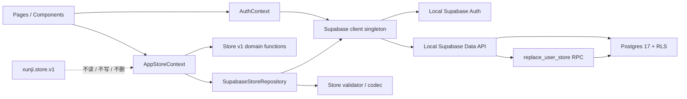

# DESIGN: 为循迹接入本地 Postgres 后端

- **Change ID**: `local-postgres-backend`
- **关联**: `@.specs/local-postgres-backend/CHANGE.md`、`@.specs/local-postgres-backend/REQUIREMENT.md`、`@.specs/CONTEXT.md`、`@.specs/ARCHITECTURE.md`
- **状态**: confirmed
- **角色**: AI（Architect）+ 人工 review
- **架构关系**: 延续 ADR-006、ADR-007；不 supersede 已接受 ADR

---

## 0. 技术栈选定

项目上下文已锁定技术栈，本阶段不重新选栈；如需调整必须回到 CHANGE / 架构决策。

- **模板**：2️⃣ Vite + React 前后端分离 SPA 的既有项目裁剪版
- **前端**：Vite 8.1 + React 19.2 + TypeScript 7 + React Router 7
- **后端**：本地 Supabase Auth + Data API + Postgres Database Function；不另建 Hono / NestJS / Express
- **数据库**：Postgres 17（`supabase/config.toml` 当前值）
- **状态**：沿用 React Context；不新增 Redux、Zustand或 TanStack Query
- **数据库客户端**：`@supabase/supabase-js` 2.111
- **测试**：Vitest 4 + Playwright 1.62 + Supabase CLI pgTAP
- **部署**：仅同一台电脑的 Vite 开发服务 + 本地 Supabase；无公网部署
- **理由**：直接满足 AC-1～AC-8 的认证与隔离，同时保留 AC-9 的现有领域层和 AC-18 的小数据量本地性能目标，新增组件最少。
- **明确排除**：
  - 1️⃣ Next.js 全栈：会替换现有构建、路由和部署模型，超出本次持久化变更。
  - 自建 Node API：本地 Supabase 已提供 Auth、Data API 和事务函数入口，再加服务层只增加运维面。
  - Realtime / 离线队列 /服务端状态库：均不在 v1，当前刷新读取即可满足跨浏览器验收。

依据：`@package.json:1-35`、`@supabase/config.toml:5-42`、`@.specs/ARCHITECTURE.md#adr-006--使用本地-supabase-作为账号与数据后端`。

## 0.5 既有架构对齐

### 0.5.1 本次 change 触碰的既有模块

```text
触碰：
- src/App.tsx                         认证门、加载门和业务路由组合
- src/app/AppStore.tsx               同步 Store 改为账号感知的异步协调器
- src/data/repository.ts              保留 Repository 契约与 Store 编解码边界，移除生产路径的 localStorage 权威写入
- src/pages/OnboardingPage.tsx        新账号的空数据 / 示例数据初始化
- src/pages/ManagePage.tsx            异步提交、当前账号导入导出、退出入口配合
- src/pages/TodayPage.tsx             异步打卡与最近 7 天纠正，等待服务端确认后再呈现成功
- src/pages/RecoveryPage.tsx          服务端数据校验失败后的恢复入口
- src/components/AppShell.tsx         当前账号与退出、保存 / 错误状态呈现
- src/styles.css                      仅补 UI-DESIGN 确认的账号与状态样式
- vite.config.ts                      固定本地前端端口以对齐 Auth site URL
- tests/data、tests/ui、tests/e2e     同步模型改造与 AC 回归

新增：
- src/auth/AuthContext.tsx            注册、登录、会话恢复、退出及认证状态
- src/data/supabaseClient.ts          唯一 Supabase 浏览器客户端
- src/data/supabaseRepository.ts      账号 Store 读取、分页和记录级写入
- supabase/migrations/<timestamp>_local_postgres_backend.sql
- supabase/tests/database/*.sql       RLS、约束与原子替换 pgTAP

禁动：
- src/domain/dates.ts、store.ts、weeklyReport.ts、insights.ts、coOccurrence.ts 的既有业务口径
- openspec/、review_test/、设计参考资产
- 浏览器中已经存在的 xunji.store.v1 内容
- Supabase Auth 内部表结构和任何高权限密钥
```

实际定位依据：`@src/App.tsx:1-42`、`@src/app/AppStore.tsx:16-128`、`@src/data/repository.ts:1-72`、`@src/pages/ManagePage.tsx:1-217`、`@src/pages/TodayPage.tsx:19-40`、`@src/pages/TodayPage.tsx:123`、`@src/domain/store.ts:11-235`。

### 0.5.2 既有抽象沿用对照表

| 本次需要 | 既有能力 / 路径 | 决定 |
|---|---|---|
| 领域命令与校验 | `src/domain/store.ts` | 原样沿用；写入前后均通过 `validateStore` |
| 日期口径 | `src/domain/dates.ts` | 原样沿用本地 `YYYY-MM-DD` |
| 应用状态 | `src/app/AppStore.tsx` 的 React Context | 沿用 Context 范式，内部改为异步，不引状态库 |
| JSON 预览 / 序列化 | `src/data/repository.ts` | 抽成不访问存储的编解码职责继续复用 |
| 业务持久化 | `LocalStoreRepository` | 不复用其 localStorage 读写；新增 Supabase Repository 落实 ADR-007 |
| 错误提示 | `AppStore.error` + `AppShell` 的 `aria-live` | 沿用可见文本和辅助技术状态，扩充错误类别 |
| 恢复页面 | `src/pages/RecoveryPage.tsx` | 沿用“失败不覆盖”原则，文案和操作由 UI-DESIGN 决定 |
| HTTP / Auth 客户端 | 当前没有 | 新增一个 Supabase client 单例；页面不得直接调用 |

### 0.5.3 沿用模式 vs 引入新模式

- **领域计算：沿用** Store v1 + 纯函数，避免把统计和产品规则搬进数据库。
- **状态管理：沿用** React Context，新增 AuthContext 是同一模式的职责拆分，不引入第二套状态库。
- **数据访问：沿用** Repository 边界，但契约改为异步账号数据访问；页面仍只调用应用层动作。
- **普通写入：引入记录级差异持久化**，因为 ADR-007 明确避免每次操作整份 Store 覆盖。
- **完整替换：引入数据库事务函数**，因为 Data API 的多次 delete / insert 无法满足 AC-12 的全有或全无。
- **初始化状态：引入 `user_data_state`**，因为零行既可能是“新账号未选择初始化方式”，也可能是“已选择空白开始”；必须由服务端区分并跨浏览器一致。
- **并发策略：本轮采用后确认写入覆盖前值**；不做版本冲突、合并或 Realtime，符合 v2 边界。

## 1. 决策清单

| # | 决策 | 备选 | 选择理由 | 取舍代价 | 依据 |
|---|---|---|---|---|---|
| D1 | 浏览器直接使用本地 Supabase Auth / Data API | 自建 Node API；继续 localStorage | 已有依赖和本地栈，最短路径满足账号与跨浏览器 | 依赖本地服务；不可直接作为生产部署 | ADR-006、AC-1～AC-8 |
| D2 | AuthContext 与 AppStoreContext 分离 | 全塞进 AppStore；新增状态库 | 认证生命周期和业务 Store 生命周期不同；仍沿用 Context | 多一层 Provider 和异步门控 | AC-1～AC-3、架构 hard rules |
| D3 | Store v1 继续作为领域投影，Repository 负责关系行映射 | 页面直接使用数据库行；数据库返回 JSON Store | 不改既有领域与统计规则，保持导入导出格式 | 读取后需要映射和完整校验 | ADR-007、AC-9、AC-11 |
| D4 | 新增 `user_data_state` 初始化标记 | 用零 Habit 判断；用业务 localStorage 标记 | 空白初始化后仍可能零行，只有服务端标记能跨浏览器区分 | 增加一张极小关系表和一组 RLS | AC-3、AC-10 |
| D5 | 业务表使用账号复合键、复合外键和 RLS | 全局单列主键 + 前端过滤 | 数据库同时保证所有权、引用一致和 Completion 唯一性 | SQL 与数据库测试更复杂 | ADR-007、AC-5、AC-7～AC-8 |
| D6 | 普通操作比较前后 Store，只提交一项记录级变化 | 每次完整替换；页面直接写表 | 兼容现有 `commit(buildNext)`，同时避免打卡时重写全部历史 | Repository 必须拒绝无法识别的多项变化 | AC-4～AC-6、ADR-007 |
| D7 | 空白初始化、示例数据和确认导入统一调用原子替换 RPC | 客户端串行 delete / insert；JSON 快照表 | 一次数据库事务满足全有或全无，失败保留原数据 | 需要受控 Database Function 和数据库侧结构校验 | AC-10、AC-12～AC-13、ADR-008 |
| D8 | Completion 按稳定复合键排序并以最多 1000 行分页读完 | 单次 select；只读 90 天；JSON 聚合 RPC | 导出和完整 Store 必须覆盖全部历史，当前上限明确为 1000 | 3,650 条记录需至少 4 页请求 | AC-11、AC-18 |
| D9 | 只有服务端成功响应后才发布候选 Store；失败保留最后确认值 | 乐观更新后回滚；失败写 localStorage | 直接满足“不伪造成功”，减少复杂回滚 | 操作反馈受本地 API 延迟影响 | AC-15、数据完整性 NFR |
| D10 | Vite 固定 `127.0.0.1:3000` 且端口占用时失败 | 改 Supabase 为 5173；允许 Vite 自动换端口 | 与现有 Auth `site_url` 一致，避免实际地址漂移 | 3000 被占用时需先释放端口 | AC-1～AC-3、当前配置 |
| D11 | 客户端只读取 Vite 的 URL + publishable key 环境变量 | 硬编码本地 key；使用 service-role | 保持配置可替换且高权限凭据不进客户端 | DEV 设置 `.env.local` 前必须单独获批 | AC-19、项目红线 |
| D12 | 用 Repository 读取计时定义性能门禁，不加外部埋点 | 页面整体 Lighthouse；外部监控 SDK | 可重复衡量“开始读到 Store 可用”，正好覆盖 AC-18 | 仅代表本机本地栈，不代表生产 SLA | AC-18、可观测性 NFR |

Supabase 外部契约依据：[RLS](https://supabase.com/docs/guides/database/postgres/row-level-security)、[Auth session](https://supabase.com/docs/reference/javascript/auth-getsession)、[Database Functions](https://supabase.com/docs/guides/database/functions)、[RPC](https://supabase.com/docs/reference/javascript/rpc)。

## 2. 数据流 / 架构图

### 2.1 运行时边界



依赖方向保持：`UI → app/auth → data → domain`；`domain` 不依赖 React、Supabase 或浏览器 API；`data` 不依赖 UI。

### 2.2 登录与读取

```text
App 启动
  → AuthContext 恢复 Supabase session
  → 无 session：清空内存 Store，显示账号入口
  → 有 session：记录当前 user.id 和本次加载序号
      → Repository 读取 user_data_state
      → 未初始化：返回 null，显示现有首次进入选择
      → 已初始化：分页读取 habits + completions
          → 映射为 Store v1 → validateStore
          → user.id / 加载序号仍匹配：发布到 AppStore
          → 已退出或已切账号：丢弃迟到响应
```

### 2.3 普通写入

```text
页面动作
  → 既有 domain 函数基于最后确认 Store 生成 candidate
  → validateStore(candidate)
  → Repository 比较 previous / candidate
  → 只允许一个逻辑变化：Habit 新增/修改/归档，或 Completion upsert/delete
  → Data API 在 RLS 下执行并等待成功响应
  → 成功：发布 candidate + “已保存”
  → 失败：保留 previous + 显示分类错误
```

同一账号两个浏览器不共享前端内存。另一个浏览器只有在登录、刷新或重新进入时重新读取；最后被 Postgres 确认的普通写入是后续读取结果。本轮不检测并发覆盖。

### 2.4 初始化与完整替换

```text
空白开始 / 示例数据 / 已确认 JSON 导入
  → 客户端 validateStore
  → 调用 replace_user_store(Store v1 JSON)
  → RPC 从 auth.uid() 获取账号，不接受 user_id 参数
  → 数据库结构校验
  → 同一事务内：删除当前账号旧行 → 插入新 Habit → 插入新 Completion → 写初始化标记
  → 任一步失败：整次调用回滚
  → 成功：客户端重新 read() 并发布服务端投影
```

## 2.5 数据库契约

### 表与约束

| 表 | 字段 | 主键 / 外键 / 检查 | 用途 |
|---|---|---|---|
| `user_data_state` | `user_id uuid`、`initialized_at timestamptz` | PK `user_id`；FK → `auth.users.id ON DELETE CASCADE` | 区分未初始化与已确认空 Store |
| `habits` | `user_id uuid`、`id text`、`name text`、`target_per_day int`、`created_on date`、`archived_on date?` | PK `(user_id,id)`；user FK；ID 与名称非空；目标 > 0；归档日不早于创建日 | Habit 关系记录 |
| `completions` | `user_id uuid`、`habit_id text`、`date date`、`count int` | PK `(user_id,habit_id,date)`；user FK；复合 FK → habits，`ON DELETE CASCADE`；count > 0 | Completion 唯一记录 |

- 所有业务日期使用 Postgres `date`，映射为 `YYYY-MM-DD`；不引入时区换日逻辑。
- Habit 业务 ID 使用 `text`，与 Store v1 的“非空字符串”校验一致并兼容内置 `demo-reading` 等 ID；只把账号所有权 ID 保持为 Supabase Auth `uuid`。不在持久化边界强迫现有 Store、示例数据或合法备份改用 UUID。— 来源：用户于 2026-07-31 确认、`@src/domain/store.ts:162-180`、`@src/data/demo.ts:14-36`
- 复合主键前缀 `user_id` 同时服务账号读取和 RLS；首轮不加冗余索引，性能不达标时以查询计划为证据再加。
- `count <= target_per_day`、Completion 位于 Habit 有效期、目标锁定等产品规则继续由 `validateStore` 和领域命令负责；数据库负责可直接表达的形状、唯一性、引用和所有权约束。RPC 导入还要复查跨行引用和重复项。
- 不创建 JSON Store 快照列，不修改 Supabase 的 `auth.users` 表。

### RLS 与授权

三张表均启用 RLS：

- 只向 `authenticated` 授予实现所需的 SELECT / INSERT / UPDATE / DELETE；`anon` 无业务表权限。
- SELECT / DELETE：`auth.uid()` 必须等于 `user_id`。
- INSERT：新行 `user_id` 必须等于 `auth.uid()`。
- UPDATE：旧行和新行 `user_id` 都必须等于 `auth.uid()`，不能转移所有权。
- `replace_user_store` 使用默认的 `SECURITY INVOKER`、空 `search_path` 和完全限定表名；撤销 `public` / `anon` 执行权，只授予 `authenticated`。
- 客户端不得使用 `service_role`、数据库连接串、数据库密码或签名密钥。

### 应用契约（签名级，不含实现）

```text
AuthContext:
  status: booting | signed_out | authenticated | error
  user: { id, email } | null
  signUp(email, password): Promise<Result>
  signIn(email, password): Promise<Result>
  signOut(): Promise<Result>

StoreRepository:
  read(): Promise<Store | null>
  commit(previous, candidate): Promise<Store>
  replace(candidate): Promise<Store>
  previewImport(raw): ImportPreview
  serialize(store): string

AppStoreContext:
  status: idle | loading | ready | saving | error
  store: Store | null
  commit(buildNext, successMessage?): Promise<boolean>
  beginEmpty(): Promise<boolean>
  beginDemo(): Promise<boolean>
  confirmImport(preview): Promise<boolean>
  reload(): Promise<boolean>
```

`ImportPreview` 移到 domain / app 可共享类型，消除 `ManagePage → data` 的现有类型依赖；页面不得 import Supabase client 或 Repository 实现。

### 分页与性能测量

- Habit 和 Completion 查询都使用稳定主键顺序；每页最多 1000 行，以页长小于 1000 作为结束条件。
- Completion 为性能主路径；10 个 Habit + 3,650 条 Completion 预计 1 次状态读取、1 次 Habit 读取和 4 次 Completion 读取。
- 任一页失败则整次 read 失败，不发布不完整 Store；合并后必须通过 `validateStore` 才进入 UI。
- UAT-PERF-01 从 Repository 开始账号数据读取计时，到 AppStore 发布已校验 Store、今天页列表和摘要可用为止；预热后连续刷新 20 次，记录全部样本和 P95，至少 19 次 ≤ 1000ms。
- 不缓存业务 Store 到 localStorage；性能不达标先记录各页耗时和 Store 校验耗时，再决定索引或读取形态。

## 3. 关键状态机

### 3.1 认证与数据门

| 当前状态 | 事件 | 下一状态 | 必须动作 |
|---|---|---|---|
| `booting` | 无有效 session | `signed_out` | Store 置空，显示账号入口 |
| `booting` | 恢复有效 session | `loading_store` | 按该 user 读取账号数据 |
| `signed_out` | 注册 / 登录成功 | `loading_store` | 记录 user，读取初始化标记和 Store |
| `loading_store` | 未初始化 | `onboarding` | 不读取旧 localStorage |
| `loading_store` | 已初始化且校验通过 | `ready` | 发布 Store |
| `loading_store` | Auth / API / 数据失败 | `backend_error` | 不展示账号业务数据，允许重试或退出 |
| 任意已登录态 | 退出成功或 session 消失 | `signed_out` | 立即清除 user 和内存 Store |
| 任意加载态 | user 变化 | 对应新 user 状态 | 旧请求结果作废 |

### 3.2 写入状态

| 当前状态 | 事件 | 下一状态 | 必须动作 |
|---|---|---|---|
| `ready` | 发起合法写入 | `saving` | 以最后确认 Store 构造 candidate |
| `saving` | Postgres 确认成功 | `ready` | 发布 candidate / 重读结果并提示成功 |
| `saving` | 请求失败 | `ready + error` | 保留 previous；不提示成功、不写 localStorage |
| `saving` | 重复提交 | `saving` | 阻止同一动作并发重复提交 |
| `ready` | 确认完整替换 | `saving` | 单次 RPC；成功后完整重读 |

## 4. ADR 索引

- 延续 `@.specs/ARCHITECTURE.md#adr-006--使用本地-supabase-作为账号与数据后端`
- 延续 `@.specs/ARCHITECTURE.md#adr-007--账号隔离的关系型持久化与-rls`
- 新增 `@.specs/adr/008-atomic-account-store-replacement.md`（proposed）：完整初始化 / 导入通过受控事务 RPC 替换当前账号数据

## 5. 风险

| # | 风险 | 类型 | 影响 | 概率 | 缓解 |
|---|---|---|---|---|---|
| R1 | migration / RLS 设计错误造成越权或不可写 | 实现 / 安全 | 高 | 中 | migration review；pgTAP 覆盖 anon、账号 A/B 四类操作；执行 migration 前人工确认 |
| R2 | 会话切换时旧异步请求覆盖新账号状态 | 实现 | 高 | 中 | user.id + 加载序号双检查；退出立即清空 Store；专门 UI 测试 |
| R3 | Data API 1000 行上限导致静默缺记录 | 实现 / 数据 | 高 | 高 | 稳定排序分页；3650 条 fixture；页失败即整次失败；导出数量核对 |
| R4 | 原子替换函数权限过宽或验证不足 | 安全 / 数据 | 高 | 中 | SECURITY INVOKER；不收 user_id；限制 execute；空 search_path；跨账号和失败回滚 pgTAP |
| R5 | Vite 地址与 Auth `site_url` 漂移 | 本地运行 | 中 | 中 | 固定 3000 + strict port；UAT 前核对实际浏览器地址和 Supabase status |
| R6 | 同步 `commit(): boolean` 改异步后造成重复点击或弹窗提前关闭 | 实现 / UX | 中 | 高 | UI-DESIGN 定义 saving 状态；调用方 await；按钮忙碌时禁用；回归 E2E |
| R7 | 本地 Docker / Auth / Data API 不可用 | 本地运行 | 高 | 中 | 启动前只读 status；分层错误；不回退业务 localStorage；UAT-12/13 |
| R8 | TypeScript 领域规则与 SQL 导入校验逐步漂移 | 长期债务 | 中 | 中 | Store v1 / validateStore 保持唯一产品规则源；SQL 只重复安全和结构性约束；同一 fixture 双层验证 |
| R9 | 本机 3,650 条读取未达到 1 秒 | 性能 | 中 | 低 | 先拆分请求、网络、映射、校验耗时；只以证据增加索引或调整页大小 |
| R10 | 最后确认写覆盖先前浏览器的未刷新修改 | 长期债务 | 中 | 低 | v1 明示最后写入生效；不承诺并发合并；真实冲突出现后另开 change |

## 6. 不在范围

- 公网 / 局域网 / 跨设备访问与生产部署加固。
- Realtime、离线业务缓存、离线写队列、冲突检测和自动合并。
- 旧 `xunji.store.v1` 的预览、迁移、覆盖或删除。
- 邮箱确认、找回密码、OAuth、头像、账号资料和账号删除。
- 服务端统计、物化视图、后台任务、缓存、监控 SDK 和审计日志。
- 对现有习惯生命周期、周报、洞察、共现、响应式断点或视觉体系的重设计。
- 直接把本地 Supabase 栈用于生产或把高权限凭据交给浏览器。

## 7. AC → 设计追踪

| AC | 设计落点 |
|---|---|
| AC-1～AC-3 | D2、D4、D10、认证状态机 |
| AC-4～AC-6 | D3、D6、普通写入与刷新重读 |
| AC-7～AC-8 | D5、三表 RLS、pgTAP |
| AC-9 | D3、既有 domain 禁动清单 |
| AC-10 | D4、D7、初始化 RPC |
| AC-11 | D3、D8、完整分页与 Store v1 序列化 |
| AC-12～AC-13 | D7、ADR-008、失败回滚 |
| AC-14 | 架构图中的旧 key 隔离、禁动清单 |
| AC-15～AC-16 | D9、读写状态机、后端错误边界 |
| AC-17 | AppShell 状态契约；细节进入 UI-DESIGN |
| AC-18 | D8、D12、分页与性能测量 |
| AC-19 | D11、RLS 与授权契约 |

## 8. 阶段与实施边界

- 本 DESIGN 只定义目标，不包含可执行 migration 或业务实现。
- 本 change 包含账号入口和用户可见状态，DESIGN 确认后必须先进入 `2a-ui-design`，不能直接 DEV。
- TASK 阶段必须把 migration 生成、数据库测试、客户端接入、UI、性能和跨浏览器 UAT 分成可独立验证的原子任务。
- DEV 中执行 migration、修改 `.env.local` 或运行 `supabase db reset` 前，必须按项目红线再次取得人工确认。

## 9. 架构沉淀建议

以下是本 change 完成后供 `A-evolve` review 的候选；当前 DESIGN 草案不直接改写项目级 ADR。

### 9.1 新增的可复用抽象

| 路径 | 能力 | 其他使用场景 | 复用建议 |
|---|---|---|---|
| `src/auth/AuthContext.tsx` | 统一认证生命周期和迟到响应隔离 | 未来账号资料；显式旧数据迁移 | 所有账号状态只从该入口消费 |
| `src/data/supabaseRepository.ts` | RLS 下分页读取、记录级提交、完整替换 | 未来数据迁移预览；备份恢复 | 页面不得直接写 Supabase |

### 9.2 新增 / 改变的项目级技术决策

| 决策 | 取值 | 影响范围 | 推翻代价 |
|---|---|---|---|
| 账号空数据语义 | `user_data_state` 服务端初始化标记 | Onboarding、刷新、跨浏览器 | 中；需迁移已有账号 |
| 完整 Store 替换 | 受控 `SECURITY INVOKER` RPC | 空白、示例、JSON 导入 | 中；替换需重做原子性测试 |

### 9.3 新增 / 修改的跨模块契约

- 三张业务表：`user_data_state`、`habits`、`completions`，均以当前 Auth user 为 RLS 边界。
- `replace_user_store(Store v1 JSON)`：只作用当前 `auth.uid()`，成功后客户端完整重读。
- AppStore `commit` 与初始化 / 导入动作从同步返回改为 `Promise<boolean>`。

### 9.4 新增 / 升级的依赖

- 本 change 不建议新增依赖；复用已存在的 `@supabase/supabase-js` 和 Supabase CLI 2.111。

### 9.5 禁动清单变化

- 新增禁动：页面 / 组件不得直接 import Supabase client 或 Repository 实现。
- 新增禁动：后端失败不得把 Habit / Completion 写回 `xunji.store.v1`。
- 新增禁动：`replace_user_store` 不得接受或信任客户端传入的 `user_id`。

---

> 本文件不包含完整实现代码；数据库字段、函数签名和状态图均为设计契约。
