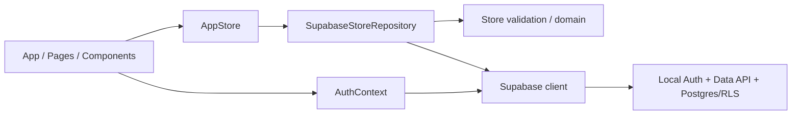

# REVIEW: 为循迹接入本地 Postgres 后端

- **Change ID**：`local-postgres-backend`
- **审查时间**：2026-08-01 09:25（首轮）；09:29（T-FIX-04 重审）
- **审查者**：AI Reviewer + 独立完整审查 + 安全/认证跨模型 spot-check
- **Git 范围**：`2b369e0..7db05ce`
- **总体结论**：✅ APPROVED；首轮 Important 1 已由 T-FIX-04 关闭，重审 0/0/0

---

## 第一轮 · Spec 合规审查

| 检查项 | 结果 | 证据 |
|---|---|---|
| AC-1～AC-19 已实现 | ✅ | `@.specs/local-postgres-backend/TEST.md#11-测试矩阵ac--用例` |
| AC-1～AC-19 已测试 | ✅ | Vitest 187、pgTAP 174、Playwright 12、真实 Chrome↔Edge UAT |
| 未引入 out of scope | ✅ | 无远程部署、第三方同步、密码找回、离线业务写入或 localStorage 回退 |
| 未范围蔓延 | ✅ | 仅本地 Auth/Postgres/RLS、账号状态、既有功能迁移与验证资产 |
| 未越过 DESIGN 边界 | ✅ | Auth → AppStore → Repository → Supabase；触碰范围与 DESIGN 一致 |
| UI-DESIGN 行为一致 | ✅ | F-1 已由 T-FIX-04 关闭；timer 不再依赖动画事件 |

**Spec 合规结论**：通过。

---

## 第二轮 · 代码质量审查

### 2.0 TEST.md 五轮完整性

| 轮次 | 状态 | 结论 |
|---|---|---|
| 1 功能 | ✅ | AC 全覆盖，行覆盖 93.61%，core ≥97.82% |
| 2 性能 | ✅ | 预算、20 次实测、首次基线/N/A、分页完整性均明确 |
| 3 安全 | ✅ | 依赖、密钥、Semgrep、OWASP 均有处理；RSC-only high 有不可达证明 |
| 4 兼容 | ✅ | 真实 Chrome↔Edge、目标视口、up→down→up、Store v1 |
| 5 可观测 | ✅ | UI 错误、耗时、敏感日志、health 及外部遥测 N/A 逐项说明 |

### 2.1 六维衰退风险统计

| 编号 | 风险 | 🔴 | 🟡 | 🟢 |
|---|---|---:|---:|---:|
| R1 | Cognitive Overload | 0 | 0 | 0 |
| R2 | Change Propagation | 0 | 0 | 0 |
| R3 | Knowledge Duplication | 0 | 0 | 0 |
| R4 | Accidental Complexity | 0 | 0 | 0 |
| R5 | Dependency Disorder | 0 | 0 | 0 |
| R6 | Domain Model Distortion | 0 | 0 | 0 |

### 2.2 详细发现

### 🟡 R2 · Change Propagation：Toast 业务状态生命周期依赖 CSS 动画事件

**Symptom**：`src/components/AppShell.tsx:111-120` 只用 `onAnimationEnd={clearMessages}` 清除成功 notice；`src/styles.css:550-564` 在 `prefers-reduced-motion: reduce` 对 `.toast` 设置 `animation: none !important`，因此不会派发 `animationend`，成功提示永久残留。现有 `tests/ui/AppShell.test.tsx:142-153` 与 `tests/e2e/app.spec.ts:312-320` 只断言可见，未断言消失。

**Source**：Hunt & Thomas · *The Pragmatic Programmer* · Orthogonality；视觉动画策略不应决定业务状态生命周期。

**Consequence**：减弱动效用户会持续看到过期“已保存”，与 UI-DESIGN“普通成功沿用短暂 Toast、失败持续显示”冲突，并持续占用 `aria-live` 状态区域。

**Remedy**：在 AppShell 用可清理 timer 管理 notice 生命周期；动画只负责视觉。新 notice 或卸载时取消旧 timer；补 fake-timer 组件回归和 reduced-motion E2E 消失断言。

**生成 fix 任务**：T-FIX-04。

**关闭证据**：提交 `8c4906b`；组件 fake timer 9/9、reduced-motion E2E 10/10、typecheck PASS。独立重审确认新 notice/卸载会清理 timer，error-only 状态不启动 timer，结论 APPROVED。

其余维度未发现可操作问题。Auth/AppStore 的 generation guards、Repository 分页和 RPC 原子替换虽然代码量较大，但边界方向清晰且有竞态/真实数据库证据，不把“文件长”单独当缺陷。

### 2.3 架构依赖

- 循环依赖：无。
- 反向依赖：无；`domain→outer`、`data→UI`、`auth→UI` 扫描均 0。
- 浏览器没有直接连接数据库，只有 publishable key；三表强制 RLS，RPC 为 SECURITY INVOKER。

---

## 第三轮 · UI 视觉审查

### 3.1 Tokens 与视觉北极星

- 新增账号 UI 只使用 `UI-DESIGN.md` frontmatter 对应的 OKLCH token；新增 CSS 原始 hex/white/black/rgba 命中 0。
- 字体沿用 Noto Sans SC Variable / PingFang SC / Microsoft YaHei；未引入 Inter/Roboto/Arial/system-ui 主字体。
- 审查截图：`@.specs/local-postgres-backend/evidence/review-account.png`。灰绿画布、深墨主操作、淡紫文字动作与“安静、克制、可信”北极星一致。

### 3.2 Anti-pattern 与无障碍

- 无新增渐变文字、彩色侧条、玻璃卡片、bounce/elastic、layout 动画、placeholder 代 label 或无 ESC Modal。
- 键盘焦点、44px 触控、Modal focus trap/恢复、显式 label、reduced-motion 均有自动化；F-1 是 reduced-motion 的状态生命周期遗漏。
- Token 对比度实测：primary/surface 17.35:1、secondary 5.32:1、tertiary 4.65:1、brand-deep 6.67:1、error 6.29:1，均达到普通文本 WCAG 2.1 AA。

**UI 结论**：通过；F-1 已关闭。

---

## 第四轮 · 补充审查

### 4.1 技术债评估

未触发：本 change 不是季度/里程碑重构，且未安装 brooks-lint，不做凭感觉债务排名。

### 4.2 跨模型分歧

| 主审发现 | spot-check | 是否一致 | 处理 |
|---|---|---|---|
| F-1 reduced-motion Toast 永久残留 | 未发现（spot-check 聚焦安全/认证/数据） | 仅主审提出 | 证据成立，纳入 T-FIX-04 |
| RLS/RPC/竞态/凭据无问题 | 同结论 | 一致 | 通过 |

---

## 总结

- Critical：0。
- Important：首轮 1，已修复并重审关闭；当前 0。
- Minor：0。
- **下一步**：进入 INTEGRATION。
