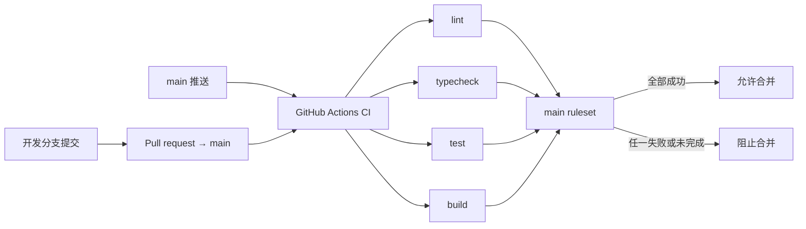

# DESIGN: 建立 GitHub CI 四关与合并保护

- **Change ID**: `ci-quality-gates`
- **关联**: `@.specs/ci-quality-gates/REQUIREMENT.md`、`@.specs/ci-quality-gates/CHANGE.md`、`@.specs/CONTEXT.md`、`@.specs/ARCHITECTURE.md`
- **作者**: AI（Architect 角色）+ 用户授权自动推进

---

## 0. 技术栈选定

- **选定**：既有 2️⃣ Vite + React SPA 的 CI 配置增量，不更换应用技术栈。
- **前端**：React 19 / TypeScript 7 / Vite 8（不修改）。
- **后端**：Supabase 托管 Auth / Data API / Postgres（不修改）。
- **部署**：Vercel + Supabase（不修改）。
- **CI 运行时**：GitHub-hosted Ubuntu runner、Node.js 24、pnpm 10.14.0。
- **关键依赖**：新增 Oxlint；GitHub Actions 使用 checkout、setup-node、pnpm setup 官方 action。
- **理由**：匹配当前本地 `node v24.11.1` 与 `packageManager: pnpm@10.14.0`。真实验证表明 `typescript-eslint` 对 TypeScript 7.0 硬失败，而 Oxlint 可解析当前源码；以最小依赖补齐 AC-1 的 lint 命令，并让 CI 不依赖本机缓存或生产配置。
- **明确排除**：不使用 ESLint（`typescript-eslint` 当前不支持 TypeScript 7.0）；不迁移 Biome；不升级应用框架或测试栈。

## 0.5 既有架构对齐

### 0.5.1 本次 change 触碰的既有模块

```
触碰模块（文件扫描所得）：
- package.json（既有；新增 lint script 与开发依赖）
- pnpm-lock.yaml（既有；锁定新增开发依赖）
- src/**/*.ts、src/**/*.tsx、tests/**/*.ts、tests/**/*.tsx（既有；仅当首次 lint 报告真实违规时，作无行为变化的规则修复）
- STATE.md、.specs/CONTEXT.md、harness-tool-audit.md（既有；记录流程、已确认约定和高风险远端操作）

新增模块：
- .github/workflows/ci.yml（GitHub Actions 质量门）
- .specs/ci-quality-gates/*（本 change 工件）

禁动清单：
- supabase/**（本次不改数据库）
- src/**、tests/** 的业务行为、产品功能与测试断言语义（仅允许 Oxlint 合规修复）
- .env*、Vercel / Supabase 配置（本次不读写任何生产配置）
- openspec/**、.specs/archive/**（本次不修改既有规格和归档）
```

### 0.5.2 既有抽象沿用对照表

| 本次需要 | 既有有没有？路径 | 决定 |
|---|---|---|
| 包管理与脚本入口 | `package.json` / `pnpm-lock.yaml` | 沿用 pnpm 与现有 `typecheck`、`test:run`、`build` 命令 |
| CI workflow | 未发现 `.github/workflows/` | 新建一个最小 workflow |
| Lint 配置与命令 | 未发现 ESLint / Biome / Oxlint 配置或 `lint` script | 新增 Oxlint 与 `pnpm lint`；规则通过显式 CLI 参数保持单一入口 |
| 远端合并保护 | GitHub rulesets API 返回空，`main` protection 为 404 | 新建一个仅保护 `main` 的 active ruleset |

### 0.5.3 沿用模式 vs 引入新模式

```
- 包管理与检查命令：沿用 pnpm scripts；Actions 只调用 package.json 公开命令，不复制检查实现。
- 质量门编排：引入 GitHub Actions workflow；现有仓库没有替代抽象。
- 合并保护：引入 GitHub ruleset；用同名 job context 绑定，避免手工状态名映射。
- 应用/数据层：不改变业务行为；若 lint 命中，允许最小规则合规修复，CI 不读取任何环境变量或服务端凭据。
```

---

## 1. 决策清单

| # | 决策 | 备选 | 选择理由 | 取舍代价 |
|---|---|---|---|---|
| D1 | Oxlint 作为 lint 基线，启用 React 规则并关闭不适合本项目的 Unicorn 默认插件 | ESLint、Biome、只运行 TypeScript | 当前 TypeScript 7.0 使 `typescript-eslint` 真实执行硬失败；Oxlint 1.76.0 已在本仓库成功解析 TypeScript / React 源码并报告可定位问题 | Oxlint 规则生态与 ESLint 不完全相同；本次只建立最小质量基线 |
| D2 | 四个独立 GitHub Actions job：`lint`、`typecheck`、`test`、`build` | 单一串行 job、矩阵 job | 对应用户指定的四关，可分别失败、重跑与绑定 required checks | 每个 job 都安装依赖，消耗更多 runner 时间 |
| D3 | workflow 只在 `pull_request → main` 与 `push → main` 触发 | 所有分支 push、仅 PR | 保持信号聚焦在合并/默认分支健康，避免任意开发分支消耗 CI | 首次验证需通过 PR 触发 |
| D4 | workflow 权限固定 `contents: read`，依赖安装使用 `--frozen-lockfile` | 默认 token 权限、普通 install | 满足 AC-3，减少供给链与权限面，并保证锁文件是唯一依赖版本来源 | 未来需要发布、评论或写缓存时须显式扩权/另开 change |
| D5 | `main` active ruleset 要求同名四个 GitHub Actions check，并启用严格最新分支策略 | branch protection、仅在 UI 选 required checks、增加 PR 审批 | 用户明确要求 ruleset 或分支保护；ruleset API 可配置且能精确审计四关 | 直接向 main 的变更也受质量门影响；本次不增加人工审批 |

## 2. 数据流 / 架构图



数据边界：workflow 只检出仓库与安装锁定 npm 依赖；不读取 `.env`、Supabase、Vercel 或任何生产数据。外部写入只有 GitHub ruleset 配置。

## 3. 关键状态机

| 当前状态 | 事件 | 下一状态 | 结果 |
|---|---|---|---|
| PR waiting | 任一 job 排队 / 运行 | blocked | GitHub 不允许合并 |
| PR blocked | 任一 job failure | blocked | GitHub 不允许合并，日志指向失败 job |
| PR blocked | 四个 job success 且分支最新 | mergeable | 本次四关不再阻止合并 |
| PR mergeable | 新提交推送 | waiting | 原有 checks 失效，重新运行四关 |

## 4. ADR 索引

本 change 不新增 ADR。D1～D5 都是可逆的仓库质量配置，不修改 `.specs/ARCHITECTURE.md` 中的应用边界或 ADR-001～ADR-009。

## 5. 风险

| # | 风险 | 影响 | 概率 | 缓解 |
|---|---|---|---|---|
| R1 | 新 lint 规则报告既有代码问题 | 首次 CI 红灯，阻塞后续合并 | 中 | 已本地运行并定位两处真实问题；只做无行为变化修复，禁止用 allow-failure 或全局禁用核心规则掩盖 |
| R2 | required context 与实际 job 显示名不一致 | ruleset 可能错误阻塞或不阻塞 PR | 中 | push workflow 后读取真实 run jobs，再以返回的精确名称写入并 GET 回读 ruleset |
| R3 | GitHub ruleset API 权限或计划限制 | 不能建立 active 合并保护 | 低 | 先以当前 CLI 账号读写 API；若拒绝，保留 CI workflow 和完整错误证据，改用同等 branch protection API 仅在可用时作为回退 |
| R4 | GitHub runner / npm registry 暂时不可用 | 无法在本次运行取得绿色 Actions | 低 | workflow 固定依赖与 runner，记录 run 证据；不将临时 GitHub 外部故障误判为代码失败 |

## 6. 不在范围

- 不把 E2E、数据库测试、性能、覆盖率、依赖审计、SAST 或发布部署加入 workflow。
- 不增加必须人工审批、CODEOWNERS、自动合并、分支删除或直推禁令。
- 不修改生产环境、密钥、Vercel 或 Supabase 的配置。

---

## 9. 架构沉淀建议

### 9.2 新增 / 改变的项目级技术决策

| 决策 | 取值 | 影响范围 | 推翻代价 |
|---|---|---|---|
| CI 基线 | `lint`、`typecheck`、`test`、`build` 必须在 main 合并前成功 | 所有未来指向 main 的 PR | 低；修改 workflow 与 ruleset context 后重新验证 |

### 9.4 新增 / 升级的依赖

| 包 | 版本 | 用途 | 是否替换既有 |
|---|---|---|---|
| Oxlint | 以 pnpm lockfile 实际解析版本为准 | TypeScript / React 静态检查 | 否；此前没有 lint 工具 |

### 9.5 禁动清单变化

```
- 新增禁动：不得在 CI workflow 中注入或输出 Supabase、Vercel、数据库及其他生产密钥；质量门必须通过 package.json 脚本执行。
```

---

> 本文件不包含完整代码实现。
