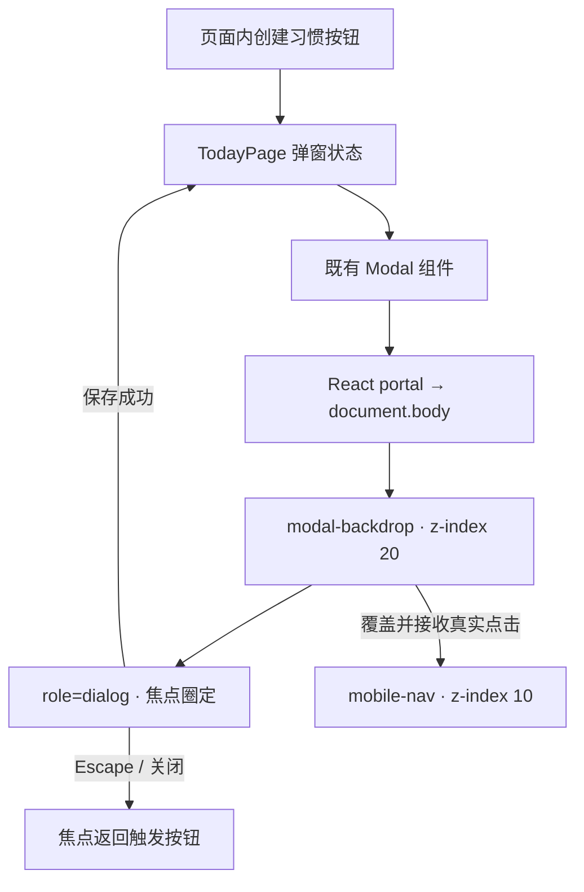

# DESIGN: 移动端与性能验证恢复全绿

- **Change ID**: `mobile-performance-green`
- **关联**: `@.specs/mobile-performance-green/CHANGE.md`、`@.specs/mobile-performance-green/REQUIREMENT.md`、`@.specs/CONTEXT.md`、`@.specs/ARCHITECTURE.md`
- **状态**: confirmed
- **角色**: AI（Architect）+ 人工预授权 review
- **架构关系**: 延续 ADR-004 的响应式契约、ADR-006～ADR-007 的本地 Supabase 数据边界；不 supersede 已接受 ADR

---

## 0₋. 架构级变更预检

`@.specs/mobile-performance-green/CHANGE.md#架构层影响声明` 已判定本 change 不涉及换栈、数据库 / 鉴权替换、公共协议变更或模块重组。本设计只修复一个既有 UI 堆叠缺陷并校正验证编排，不新增项目级 ADR。

## 0. 技术栈选定

项目技术栈已经由 `@.specs/CONTEXT.md` 与 `@.specs/ARCHITECTURE.md` 锁定，本 change 不重新选栈。

- **模板**：既有 Vite + React 前后端分离 SPA
- **前端**：Vite 8.1、React 19.2、TypeScript 7、React Router 7.18
- **后端**：本地 Supabase Auth + Data API
- **数据库**：Postgres 17 + RLS
- **测试**：Vitest 4.1、Playwright 1.62、Supabase CLI pgTAP
- **关键依赖**：沿用 `react-dom` 的 portal 能力、`@playwright/test` 的项目与命令行过滤能力；不新增依赖
- **理由**：AC-1～AC-8 都是既有响应式行为、弹窗层级和验证可信度问题；现有依赖已经完整覆盖所需能力。
- **明确排除**：不引入新的弹窗库、状态库或基准测试框架；这些选择会扩大包体和维护面，却不能比现有 React / Playwright 更直接地解决问题。

依据：`@package.json`、`@playwright.config.ts`、`@.specs/ARCHITECTURE.md#3-项目级-adr-列表`。

## 0.5 既有架构对齐

### 0.5.1 本次 change 触碰的既有模块

```text
生产代码：
- src/components/Modal.tsx            既有公共弹窗；把呈现节点移出页面堆叠上下文

验证代码与编排：
- tests/e2e/app.spec.ts               账号断言按当前视口选择真实账号区；保留真实弹窗点击回归
- tests/e2e/backend.spec.ts           新建浏览器上下文显式沿用受测项目设备参数；账号断言按视口契约执行
- tests/e2e/performance.spec.ts       增加性能分类；按桌面 / 移动使用各自可见的就绪信号
- package.json                        把功能 E2E 与资源敏感性能 E2E 分段编排，test:e2e 仍覆盖全部 24 项

不新增生产模块。

禁动：
- src/components/AppShell.tsx         当前桌面 / 移动账号信息架构已确认，不为测试改产品
- src/pages/TodayPage.tsx             当前摘要与移动周报入口的响应式契约已确认
- src/app、src/data、src/domain        本 change 不改变 Store、Repository、分页或业务口径
- supabase/**                          不改 schema、migration、RLS、RPC 或测试数据结构
- playwright.config.ts                保留两个既有目标项目和 1024px 产品断点，不全局降为单 worker
- .env.local                           不读、不改、不提交
```

实际定位依据：`@src/components/Modal.tsx`、`@src/components/AppShell.tsx:74-103`、`@src/pages/TodayPage.tsx:231-255`、`@src/styles.css:363-365`、`@src/styles.css:523-524`、`@tests/e2e/app.spec.ts`、`@tests/e2e/backend.spec.ts`、`@tests/e2e/performance.spec.ts`、`@playwright.config.ts`。

### 0.5.2 既有抽象沿用对照表

| 本次需要 | 既有能力 / 路径 | 决定 |
|---|---|---|
| 弹窗语义、焦点圈定、Escape 与焦点恢复 | `src/components/Modal.tsx` | 原样沿用组件 API 和生命周期，只改变呈现挂载位置 |
| 顶层 DOM 挂载 | `react-dom`（已有依赖） | 使用内置 portal；不引第三方弹窗 / portal 包 |
| 桌面 / 移动账号契约 | `src/components/AppShell.tsx` | 沿用“桌面邮箱 + 桌面标识 / 移动标识 + 图标退出”契约 |
| 响应式就绪节点 | `TodayPage.tsx` + `styles.css` | 桌面使用 `.summary-panel`，移动使用 `.mobile-week-link` |
| 性能样本与分页证据 | `tests/e2e/performance.spec.ts` | 保留 20 次、19 次达标、1,000 ms 和 5 个分页范围 |
| 视口矩阵 | `playwright.config.ts` | 保留 desktop 与 Pixel 7 两个项目，不建第三套设备定义 |

### 0.5.3 沿用模式 vs 引入新模式

- **弹窗组件：沿用** 单一 `Modal` 公共组件和现有全局样式；portal 只是改变 DOM 挂载边界，不建立第二套弹窗实现。
- **可访问性：沿用** 既有 `role="dialog"`、`aria-modal`、初始焦点、Tab 圈定、Escape 和焦点恢复逻辑。
- **响应式 UI：沿用** ADR-004 与已确认 UI-DESIGN；测试根据真实可见区域断言，不改变产品来迁就测试。
- **E2E 上下文：校正** 手工创建的隔离浏览器上下文必须显式带入当前 Playwright 项目的设备参数，避免“mobile 项目内实际新建 desktop context”的伪覆盖。
- **性能编排：引入分段执行**；功能测试保留现有并行能力，性能文件在同一 `test:e2e` 入口的第二阶段以单 worker 跑完 desktop、mobile，避免同类基准互相争抢本地 Supabase / 浏览器资源。

## 1. 决策清单

| # | 决策 | 备选 | 选择理由 | 取舍代价 | 依据 |
|---|---|---|---|---|---|
| D1 | `Modal` 通过 React portal 挂到 `document.body` | 继续提高 `z-index`；暂时隐藏底部导航；强制点击 | `.page-enter` 的 transform 与 `.app-content` 已形成嵌套堆叠上下文，子节点的高 `z-index` 无法越过外部 `.mobile-nav`；portal 从根因解除层级限制，同时保留真实导航 | 弹窗 DOM 不再是页面节点的物理子元素；测试必须继续按 dialog role 查找，不能依赖页面后代选择器 | AC-2～AC-3；`@src/components/Modal.tsx`、`@src/styles.css` |
| D2 | 账号 E2E 通过命名账号组与视口模式选择断言 | 所有项目都断言桌面邮箱；把桌面信息显示到手机；宽泛文本正则 | 产品已明确两套展示契约；按 `桌面账号` / `移动账号` group 收窄选择器，既验证可见内容，也避免隐藏重复节点误命中 | 测试 helper 需要接收当前设备 / 视口信息 | AC-1、AC-6、AC-8；ADR-004 |
| D3 | `backend.spec.ts` 的三个 `browser.newContext()` 显式复用当前项目的设备上下文参数 | 继续用无参数 context；只保留顶层 `page` fixture；复制整套设备常量 | 测试目标是跨隔离浏览器上下文，不能改成单 context；参数从项目配置派生可让 desktop / mobile 两轮真正覆盖对应设备且无重复常量 | 只应转交 BrowserContext 支持的参数，不能盲传 reporter、trace 等 runner 配置 | AC-1、AC-6；`@playwright.config.ts`、`@tests/e2e/backend.spec.ts` |
| D4 | 页面就绪 helper 按视口分支：桌面摘要可见；移动周报入口可见且桌面摘要隐藏 | 两种视口都等待摘要；仅等待网络空闲；新增测试专用 DOM 标记 | 这些节点就是当前用户真正能看到的 UI；结合 10 行 Habit 与分页响应证据，可同时证明 Store 已发布和数据完整 | 未来若响应式信息架构变化，需要同步更新 UI-DESIGN 与该 helper | AC-4；`@src/pages/TodayPage.tsx`、`@src/styles.css:523-524` |
| D5 | 给性能场景加明确分类；`pnpm test:e2e` 先并行跑 22 项非性能用例，再以 `--workers=1` 跑 desktop / mobile 两项性能用例 | 全局 `workers: 1`；允许两项性能并发；新建外部 benchmark runner | 只隔离已证明资源敏感的测量，避免把全套功能回归无谓串行；入口仍覆盖原 24 项且任一阶段失败即失败 | Playwright 控制台会分两段报告 22 + 2，而不是单段 24；脚本需保持性能分类与文件一致 | AC-5～AC-8；隔离 desktop 实测 20/20、并发全套实测 14/20 |
| D6 | 保持既有性能阈值、样本数、Data API 分页捕获和 trace | 放宽超时；减少样本；只看 P95；mock 后端 | 当前失败已定位为验证并发污染与移动错误就绪节点，不是阈值本身错误；完整分页证据仍是“数据真的读全”的必要条件 | 本机服务异常仍会让基线失败，这是可信验证应保留的敏感度 | AC-4～AC-5、AC-8 |

## 2. 数据流 / 架构图

### 2.1 弹窗呈现与交互



业务状态和保存动作仍归页面 / AppStore；`Modal` 只负责呈现与可访问性交互，不依赖 Supabase 或领域层。

### 2.2 完整 E2E 编排

```text
pnpm test:e2e
  ├─ 阶段 A：非 performance 分类（现有 worker 并行）
  │    ├─ desktop：app + backend = 11
  │    └─ mobile： app + backend = 11
  │
  └─ 阶段 B：performance.spec.ts（workers=1）
       ├─ desktop：20 次刷新 → 真实 desktop 就绪节点 + 5 段分页证据
       └─ mobile： 20 次刷新 → 真实 mobile 就绪节点 + 5 段分页证据

任一命令、项目、样本门槛或分页断言失败 → test:e2e 非零退出。
总覆盖：22 + 2 = 24 项；没有 skip / fixme / force click。
```

### 2.3 视口契约

| 受测模式 | 账号区 | Store 就绪辅助信号 | 必须隐藏 |
|---|---|---|---|
| desktop（1440 × 1000） | `桌面账号`；本机账号数据、当前邮箱、退出账号 | `.summary-panel` 可见 | `移动账号` |
| mobile（390 × 844） | `移动账号`；本机数据、退出账号图标 | `.mobile-week-link` 可见 | `桌面账号`、`.summary-panel` |

两种模式都必须同时看到 10 个 `habit-row`；性能用例还必须从响应中核对 10 个 Habit、3,650 个 Completion 和精确分页范围。

## 3. 关键状态机

### 3.1 Modal 生命周期

| 当前状态 | 事件 | 下一状态 | 必须行为 |
|---|---|---|---|
| closed | 用户激活创建按钮 | open | portal 挂载到 body；关闭按钮获得焦点 |
| open | Tab / Shift+Tab | open | 焦点留在 dialog 内 |
| open | Escape 且未禁用关闭 | closed | 卸载 portal；焦点返回触发按钮 |
| open | 普通点击保存 | saving / closed | 点击不被 mobile nav 拦截；沿用页面保存结果 |
| open + closeDisabled | Escape / 点击背景 | open | 不关闭，不改变既有禁用契约 |

性能测试没有新增产品状态；只把“Store 已发布”的判断映射到当前视口真实可见节点。

## 4. ADR 索引

本 change 不新增 ADR。D1～D6 都是局部、可逆的实现与验证决策；响应式产品契约继续引用 `@.specs/ARCHITECTURE.md#adr-004--使用单一响应式应用壳覆盖桌面与移动端`。

## 5. 风险

| # | 类型 | 风险 | 影响 | 概率 | 缓解 |
|---|---|---|---|---|---|
| R1 | 实现 | portal 改变物理 DOM 层级后，焦点恢复或背景点击语义回归 | 键盘用户无法关闭或返回原位置 | 低 | 保留既有 effect / ref 逻辑，并用 AC-2～AC-3 的真实键盘、普通点击回归验证 |
| R2 | 实现 | 手工创建的 browser context 遗漏某个关键设备参数 | mobile backend 用例仍未真正覆盖 Pixel 7 行为 | 中 | 设备参数只从 `testInfo.project.use` 的 BrowserContext 兼容字段派生，并断言当前视口 / 账号组契约 |
| R3 | 验证 / 交付 | 本地 Supabase、Docker 或机器负载异常造成性能波动 | 合法代码无法通过 19/20 门槛，阻止提交 | 中 | 健康检查先确认服务；性能场景单 worker 隔离；保留全部样本与 trace，不重试掩盖失败 |
| R4 | 长期债务 | 性能分类字符串与 package script 过滤条件漂移 | 性能场景可能被功能阶段重复执行或遗漏 | 低 | 用单一明确分类并在 `test:e2e:performance` 直接指定性能文件；AC-6 审核总数 22 + 2 = 24 |
| R5 | 长期债务 | 未来修改响应式 UI 却未同步就绪 helper | 测试再次等待隐藏元素 | 中 | 把视口就绪契约记录在 `CONTEXT.md`；UI 变更必须先更新 UI-DESIGN 和对应 AC |

## 6. 不在范围

- 不优化 Supabase 查询、分页实现、数据库索引或 Store 校验速度；隔离后仍不达标才另开性能 change。
- 不改变桌面 / 移动信息架构、1024px 断点、导航项目、账号文案或 Toast 生命周期。
- 不把主 chunk 超过 500 kB 的既有 Vite 提示混入本 change。
- 不建立 CI 性能趋势、跨机器基准、账号清理服务或生产 SLA。
- 不处理 README 的既有未提交断链修改、OpenSpec 行尾状态或其他工作区历史改动。

## 9. 架构沉淀建议

本 change 无架构层面沉淀建议。它不新增公共抽象、业务契约、依赖或项目级技术决策；“视口就绪状态”和“性能基线隔离”已经在 REQUIREMENT 阶段同步到 `@.specs/CONTEXT.md`。

---

## Architect 自检

- [x] 技术栈沿用已锁项目栈，不新增依赖
- [x] 触碰模块、沿用抽象与禁动清单已基于实际文件列出
- [x] 每条决策均包含备选、理由与代价
- [x] 数据流、视口契约和 Modal 状态机已定义
- [x] 风险覆盖实现、交付验证与长期债务
- [x] 未包含实现代码，未修改生产代码
- [x] 本 change 无需新增或 supersede ADR
