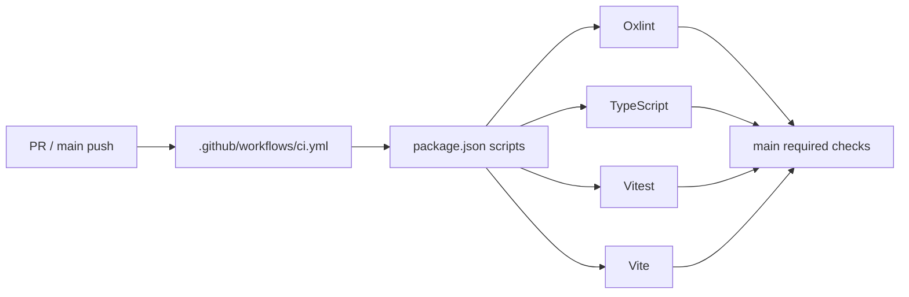

# REVIEW: 建立 GitHub CI 四关与合并保护

- **Change ID**: `ci-quality-gates`
- **审查时间**: 2026-08-02 14:22 +08:00
- **审查者**: AI（Reviewer 角色；brooks-lint 未安装，使用内置 6 维回退）
- **总体结论**: 通过（1 项既有条件性依赖风险已在 TEST 中记录，不由本 change 引入）

---

## 第一轮 · Spec 合规审查

| 检查项 | 结果 | 证据 |
|---|---|---|
| 每条 AC 都已实现 | ✅ | AC-1：`package.json:11`；AC-2/3：`.github/workflows/ci.yml:3-75`；AC-4/5：GitHub ruleset 20223088 与 PR #1 |
| 每条 AC 都有测试 | ✅ | `@.specs/ci-quality-gates/TEST.md#11-测试矩阵ac--用例` 映射 AC-1～AC-5 |
| 未引入 `out of scope` 内容 | ✅ | Diff 未新增 E2E、pgTAP、覆盖率、安全扫描 CI job、审批、部署、密钥或数据库改动 |
| 未范围蔓延 | ✅ | 新增 Oxlint、workflow、ruleset 和两处无行为 lint 合规修复，均可追溯到 D1～D5 / T01～T05 |
| 未越过 DESIGN 边界 | ✅ | `.github/workflows/ci.yml:9-75` 只读、冻结安装、四 job；`Modal.tsx:27-63` 无 CSS / API / 产品行为改变 |

**Spec 合规结论**: 通过。

---

## 第二轮 · 代码质量审查（6 维衰退风险）

### 2.0 TEST.md 5 轮金字塔完整性

| 轮次 | 状态 | 缺漏 |
|---|---|---|
| 1 功能 | ✅ | AC-1～AC-5 均有本地或真实 GitHub 证据 |
| 2 性能 | ✅ | 预算、首次基线、实测和回归观察线齐全 |
| 3 安全 | ✅ | 依赖、机密、SAST、OWASP 都有记录；既有条件性 high 明确标注 |
| 4 兼容 | ✅ | Ubuntu / Node / pnpm 实测；浏览器和 migration 不适用原因完整 |
| 5 可观测 | ✅ | 四个独立 check 与命令日志证据完整；生产服务项明确不适用 |

### 2.1 6 维诊断 · 严重度统计

| 编号 | 衰退风险 | 🔴 | 🟡 | 🟢 |
|---|---|---:|---:|---:|
| R1 | Cognitive Overload 认知过载 | 0 | 0 | 0 |
| R2 | Change Propagation 变更传播 | 0 | 0 | 0 |
| R3 | Knowledge Duplication 知识重复 | 0 | 0 | 0 |
| R4 | Accidental Complexity 偶然复杂 | 0 | 0 | 0 |
| R5 | Dependency Disorder 依赖混乱 | 0 | 0 | 0 |
| R6 | Domain Model Distortion 领域扭曲 | 0 | 0 | 0 |

### 2.2 6 维诊断 · 内置回退结论

未发现需生成 fix task 的生产代码衰退项。

- **R1**：`.github/workflows/ci.yml:17-75` 每个 job 都是相同、线性的 setup/install/run 结构；独立 job 是用户要求的四个可重跑 check，不增加隐式控制流。
- **R2**：新增 lint 入口集中于 `package.json:11`，workflow 只调用公开 script；以后规则变化只需改 script。
- **R3**：四个 job 的显式 setup 重复是 GitHub Actions 独立 runner 的必要成本，不是同一领域决策在应用层分叉；pnpm 版本和 packageManager 都是同一值且由实际 run 验证。
- **R4**：没有自定义 composite action、矩阵或 allow-failure；`.github/workflows/ci.yml:3-75` 是满足四关的最小 YAML。
- **R5**：workflow 依赖方向为 GitHub runner → package scripts → 源码；页面没有直接依赖 workflow、Supabase 或环境变量。
- **R6**：唯一业务文件改动 `src/components/Modal.tsx:27-63` 只稳定关闭后的焦点恢复，领域模型、Repository 和账户边界未变。

4 要素格式不适用于“无发现”；上述每项均给出具体验证位置，且没有伪造风险条目。

### 2.3 架构依赖图

本 change 未新增顶级模块/服务、未引入中间件、未发生跨 5 个模块重构，未触发大型 change 架构审计。

**循环依赖**：无。  
**反向依赖**：无。

---

## 第三轮 · UI 视觉审查

触发原因：本 change 有 `UI-DESIGN.md`，并修改 `src/components/Modal.tsx`。

| 检查项 | 结果 | 证据 |
|---|---|---|
| Token、颜色、字体、间距、动效未变 | ✅ | `Modal.tsx:27-63` 只新增局部 `previousFocus`；无 CSS / class / 文案改动 |
| 无硬编码色值、字号或间距 | ✅ | 本次 `.tsx` diff 不含样式属性或数值视觉 token |
| 无强制 UI anti-pattern | ✅ | 对照 `@flow-kit/reference/ui-anti-patterns.md`，没有字体、渐变、阴影、边框、动效或布局新增 |
| UI 北极星一致 | ✅ | `@.specs/ci-quality-gates/UI-DESIGN.md#1-美学北极星` 的“零视觉变更”与 diff 一致 |
| Modal 可访问性 | ✅ | `Modal.tsx:39-61` 保留 ESC、Tab 焦点陷阱与焦点恢复；相关 UI 回归 28/28 通过 |

结论：没有视觉、文案、令牌或无障碍回归；不生成 UI fix task。

---

## 第四轮 · 补充审查（按触发条件）

### 4.1 技术债评估

未触发：本 change 不是里程碑、季度大版本或跨模块重构；`brooks-lint` 未安装，且 TEST 已记录既有分支覆盖与 `react-router` 安全升级 backlog。

### 4.2 跨模型分歧

未触发：没有认证、并发/分布式或单函数大改；本次测试覆盖率没有显著下降。未伪造跨模型审查结论。

---

## 已知风险（非本 change 引入）

- `pnpm audit --prod` 报告 `react-router@7.18.1` 的 GHSA-qwww-vcr4-c8h2（high）；官方 advisory 的影响前提是使用 unstable RSC API，源码扫描未发现相关调用。
- 它不由 Oxlint、workflow、ruleset 或 Modal lint 修复引入；升级到 8.3.0+ 是跨大版本安全 change，应独立执行完整产品回归。
- 审查严重度：🟡 Major（已知、条件不满足、但需后续处理），不将其错误标为本次变更的零风险。

## 总结

- Critical 项：0。
- Major 项：1（既有条件性 React Router advisory；已在 TEST 透明记录，独立安全升级处理）。
- Minor 项：0。
- 新增 fix 任务：0。

**下一步**: 进入 `7-integration`，完成 PR UAT、同步项目上下文并合并经过 ruleset 验证的 PR。
